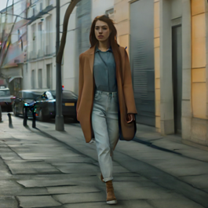
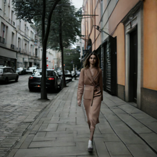
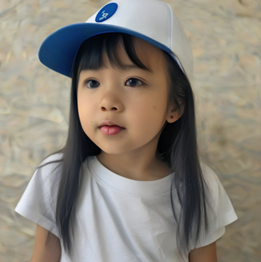
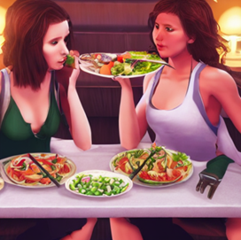
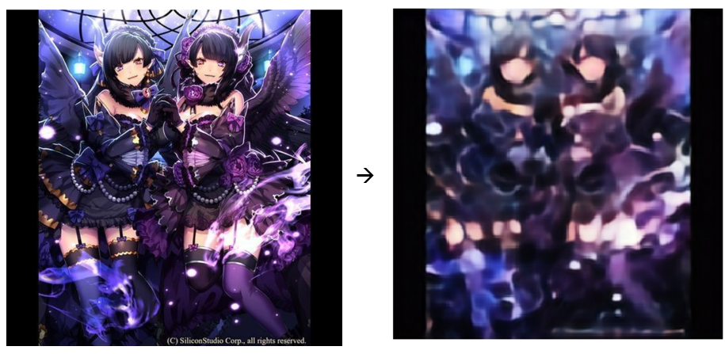
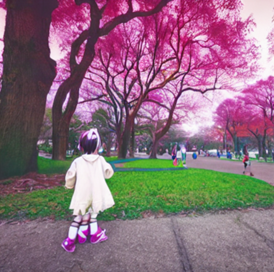
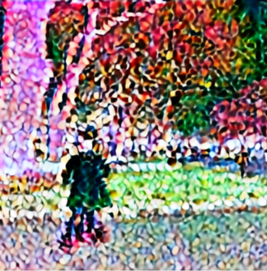

# SD-LoRA-Anime-Style

LoRA fine-tuning of **SDXL 1.0** and **SD 1.5** for anime-style image generation, with a trigger-token activation scheme and a from-scratch autoencoder benchmarked against the pretrained VAE.

This repository is a technical writeup — code is organized for reproducibility, but the README is written to explain *why* each design choice was made, not just *how* to run it.

---

## Table of Contents

- [Motivation](#motivation)
- [Method](#method)
  - [Why LoRA (and not full fine-tuning)](#why-lora-and-not-full-fine-tuning)
  - [Trigger Token: Style as an Activatable Switch](#trigger-token-style-as-an-activatable-switch)
  - [Where LoRA is Injected](#where-lora-is-injected)
- [Results](#results)
  - [SDXL 1.0](#sdxl-10)
  - [SD 1.5](#sd-15)
- [Custom Autoencoder Experiment](#custom-autoencoder-experiment)
- [Reproducing](#reproducing)
- [Limitations & Future Work](#limitations--future-work)
- [References](#references)

---

## Motivation

General-purpose diffusion models like SDXL and SD 1.5 are trained on billions of image-text pairs covering broad visual concepts. Adapting them to a narrow style (e.g. anime) with a small dataset — and on consumer-grade hardware — requires two compromises:

1. **Parameter efficiency** — updating all ~3.5B parameters of SDXL is infeasible on consumer hardware.
2. **Catastrophic forgetting avoidance** — the model should *gain* anime-style output without *losing* its general-purpose generation ability.

This project addresses both with **LoRA + trigger-token** and benchmarks the approach across two diffusion model families of very different scales.

---

## Method

### Why LoRA (and not full fine-tuning)

Classical transfer learning (swap the classifier head) does not apply here — diffusion models have no classifier. The component that controls image *content and style* is the **UNet**, specifically its attention layers. Fully unfreezing these layers would mean training hundreds of millions of parameters, which is infeasible on non-industrial hardware.

LoRA injects a low-rank matrix `BA` into target layers such that the effective weight becomes:

```
W' = W + BA,  where rank(BA) << rank(W)
```

Only `B` and `A` are trained. In this project:

| Model | Total params | LoRA trainable | Ratio |
|---|---|---|---|
| SDXL 1.0 (UNet) | 2.61 B | 46.4 M | **1.78%** |
| SD 1.5 (UNet) | 864 M | 4.78 M | **0.55%** |
| Text encoder (each) | 123 M | 295 K | **0.24%** |

### Trigger Token: Style as an Activatable Switch

A common problem with fine-tuning diffusion models: if you simply train on anime images, the model *overwrites* its general-purpose capability — prompt it for a realistic portrait and you still get anime.

The fix is to **bind the style to a rare token** that doesn't collide with existing vocabulary. I chose `xkz`:

```python
>>> tokenizer.tokenize("xkz")
['x', 'kz</w>']   # splits into 2 rarely-seen subword pieces — good
```

During training, every caption is prefixed with `xkz, `. The model learns:

- **With `xkz`** → anime style
- **Without `xkz`** → original behavior preserved

This is why LoRA must be injected into the **text encoder** as well, not just the UNet — the text encoder needs to associate the token with the style.

### Where LoRA is Injected

```python
# UNet — the core style/content predictor
# SDXL uses r=32; SD 1.5 uses r=24 (smaller UNet, lower rank suffices)
LoraConfig(
    r=32, lora_alpha=32,                                   # SDXL
    target_modules=["to_q", "to_k", "to_v", "to_out.0"],   # attention projections
)

# Text encoder — to bind the trigger token (r=8 for both SDXL and SD 1.5)
LoraConfig(
    r=8, lora_alpha=8,
    target_modules=["q_proj", "v_proj"],
)
```

For SDXL, LoRA is applied only to `text_encoder_1` (CLIP ViT-L/14). `text_encoder_2` (OpenCLIP ViT-bigG/14) handles broader semantics and is left untouched to preserve compositional understanding.

---

## Results

### SDXL 1.0

Training used **1,200 image-prompt pairs** (of 337K available, filtered by prompt token length ≤ 65), 40 validation pairs, resolution 1024×1024, AdamW with cosine-annealed LR, mixed-precision fp16.

Loss curves are **flat rather than sharply decreasing** — as expected when LoRA-tuning a heavily pretrained model. Visual inspection of checkpoint samples at each 200-step interval (sent to TensorBoard) was the primary model-selection signal. Optimal checkpoint determined at **step 3,200**: trigger-on samples have converted style while trigger-off samples retain the original realistic style.

**Prompt: "a photo of a woman walking on the street"**

| With trigger (`xkz, ...`) | No trigger |
|---|---|
|  |  |

**Prompt: "a young girl, white t-shirt, blue hat"**

| With trigger | No trigger |
|---|---|
|  |  |

### SD 1.5

SD 1.5 has ~27% of SDXL's parameter count and uses a single text encoder. Training was correspondingly faster; optimal checkpoint at **step 1,200**.

**Prompt: "two young women having dinner on the table"**

| With trigger | No trigger |
|---|---|
|  |  |

The style transfer is less consistent than SDXL — some trigger-on samples retain semi-realistic features — consistent with SD 1.5's weaker semantic grounding (single CLIP ViT-L/14 encoder, no OpenCLIP ViT-bigG/14 pair).

---

## Custom Autoencoder Experiment

Beyond LoRA, I trained a **simplified VAE-style autoencoder** from scratch to probe what happens when you replace SD 1.5's pretrained VAE with a small custom one.

### Architecture

Compared to the original SD VAE (4 DownBlocks / MidBlock / 4 UpBlocks, heavy ResNet stacking), mine uses:

- **3 DownBlocks** (single ResBlock each, stride-2 Conv2d downsample)
- **MidBlock** with self-attention (preserved — critical for global coherence)
- **3 UpBlocks** (single ResBlock each, nearest-neighbor upsample + Conv2d)
- GroupNorm + SiLU throughout
- Output: 4-channel latent via `quant_conv`

### Reconstruction Quality

Trained for 50 epochs on 1,200 images at 256×256. Loss curves show a conventional convergence shape (unlike the LoRA training). Best reconstruction at **epoch 35**.



### Drop-in Replacement into SD 1.5

The interesting experiment: **what happens if SD 1.5's pretrained VAE is swapped with this custom autoencoder in the full generation pipeline?**

**Prompt: "anime style, a little girl playing in the park"**

| Original SD 1.5 VAE | Custom Autoencoder |
|---|---|
|  |  |

The custom autoencoder produces **structurally recognizable output** — you can see character outlines, trees, a path — but color reconstruction is severely degraded, with large blocky artifacts. This confirms the autoencoder has learned *something* about the image manifold, but is nowhere near the generality of a VAE trained on billions of images.

**The pedagogical point**: VAE generality is not free. The 1.2K-image autoencoder is enough to learn local edge/texture statistics but not enough to learn a latent space that's interoperable with a UNet trained on a much broader distribution.

---

## Reproducing

Training is organized as a single top-level script that runs all three experiments (SDXL LoRA → SD 1.5 LoRA → Custom Autoencoder) sequentially, with TensorBoard logging at each checkpoint.

**Hardware used**: single consumer GPU, fp16 mixed precision, batch size 2. Full training run completes in under a day.

**Dataset**: [none-yet/anime-captions](https://huggingface.co/datasets/none-yet/anime-captions) — 337K image-prompt pairs, of which 1,240 are used (1,200 train / 40 val).

### Quickstart

The best checkpoints are shipped in `weights/` via Git LFS, so inference works without retraining.

```bash
# 1. Install (git-lfs required to fetch the 186MB SDXL adapter and 157MB AE checkpoint)
git lfs install
git clone https://github.com/hansjohn819-commits/sd-lora-anime-style.git
cd sd-lora-anime-style
pip install -r requirements.txt

# 2. Inference with shipped weights
python inference.py --model sdxl --prompt "a photo of a woman walking on the street" --trigger --output out_sdxl.png
python inference.py --model sd15 --prompt "two young women having dinner on the table" --trigger --output out_sd15.png
python inference.py --model ae   --input_image assets/sdxl_girl_with.png --output recon.png

# 3. Retrain from scratch (optional; all three stages run sequentially)
python train.py --stage all
# Or a single stage:
python train.py --stage sdxl_train --lr 1e-5 --epochs 10
```

All training/inference settings live at the top of [`train.py`](train.py) and [`inference.py`](inference.py); edit defaults there or override via CLI flags.

---

## Limitations & Future Work

**Dataset scale** — 1,200 training samples is orders of magnitude below what LoRA papers typically use. The trigger mechanism works, but the learned style is narrowly concentrated around *anime characters* because that's what dominates the dataset. Generalizing to anime-style *scenes without characters* would require dataset rebalancing.

**Evaluation is qualitative** — model selection is by TensorBoard visual inspection rather than CLIP-score or FID. This is acceptable for a personal study but would not be rigorous for a research claim. Adding automated style-similarity metrics (e.g. CLIP image-text alignment on a held-out style probe set) is a natural next step.

**Custom autoencoder is not a general-purpose VAE** — it reconstructs training-distribution anime reasonably but degrades sharply off-distribution. The VAE-swap experiment is best understood as a *diagnostic* ("how much of the pipeline does the VAE actually carry?") rather than a proposal for a practical replacement.

**Trigger token design is ad-hoc** — `xkz` works because it tokenizes into two rare sub-pieces, but a more principled approach (e.g. textual inversion with a learned embedding) would bind the style more tightly and avoid occasional trigger-leakage in the trigger-off path.

**SDXL `text_encoder_2` was not LoRA-adapted** — a deliberate choice to preserve compositional grounding, but it's untested whether adapting both encoders would improve style consistency on complex multi-subject prompts.

---

## References

- Hu, E. J., et al. (2022). [LoRA: Low-Rank Adaptation of Large Language Models](https://arxiv.org/abs/2106.09685). ICLR.
- Podell, D., et al. (2023). [SDXL: Improving Latent Diffusion Models for High-Resolution Image Synthesis](https://arxiv.org/abs/2307.01952).
- Radford, A., et al. (2021). [Learning Transferable Visual Models from Natural Language Supervision (CLIP)](https://proceedings.mlr.press/v139/radford21a/radford21a.pdf). ICML.
- Ilharco, G., et al. (2021). [OpenCLIP](https://doi.org/10.5281/zenodo.5143773).


